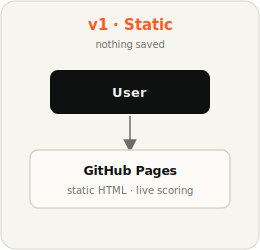
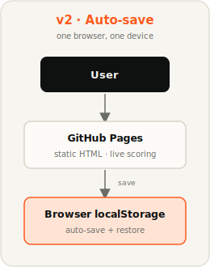
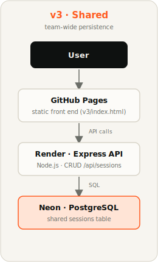

# AI-Native Team Diagnostic

An interactive, self-scoring assessment that helps teams find out how AI-native their operating model actually is — not just whether they're using AI tools, but whether the way the team works has been redesigned around them.

Three versions live in this repo, each adding one layer of capability.

🌐 **Live site:** [shayeeboy.github.io/ai-native-diagnostic](https://shayeeboy.github.io/ai-native-diagnostic/) — landing page linking all three versions.

---

## v1 — `v1/index.html`

The original build. Fully interactive, scores live, generates a diagnosis report at the bottom. Nothing is saved — close the tab and it's gone.

**Use this when:** someone wants to try the tool once with zero setup, or you're sharing it widely and don't want to explain any save/restore behavior.

🔗 [shayeeboy.github.io/ai-native-diagnostic/v1/](https://shayeeboy.github.io/ai-native-diagnostic/v1/)

## v2 — `v2/index.html`

Same diagnostic, plus auto-save. Answers save to the browser's local storage as you go, and a banner offers to restore your last session if you reopen it. A name field lets you label your saved session. Saving is local to one browser on one device — no team-wide visibility.

**Use this when:** someone might fill it out over multiple sittings on the same device.

🔗 [shayeeboy.github.io/ai-native-diagnostic/v2/](https://shayeeboy.github.io/ai-native-diagnostic/v2/)

## v3 — `v3/` + `v3-backend/`

Real shared persistence. A small Express + Postgres API backs the front end so everyone on the team can see everyone's completed diagnostics — not just their own.

**Use this when:** you want the team comparison view — not just "did I finish mine," but "where does the whole team land."

🔗 [shayeeboy.github.io/ai-native-diagnostic/v3/](https://shayeeboy.github.io/ai-native-diagnostic/v3/)

**Architecture:**
- **Front end:** `v3/index.html`, served via GitHub Pages alongside v1 and v2
- **Backend:** Node.js/Express API hosted on Render (free tier)
- **Database:** Postgres via Neon (free tier, no inactivity expiry)

---

## Repo layout

```
.
├── v1/
│   └── index.html              # static, no persistence
├── v2/
│   └── index.html              # static, browser-local auto-save
├── v3/
│   └── index.html              # static front end, calls the Render API
├── v3-backend/
│   ├── server.js               # Express API (4 CRUD endpoints)
│   ├── db/
│   │   ├── schema.sql          # Postgres table definition
│   │   ├── migrate.js          # applies schema.sql to DATABASE_URL
│   │   └── pool.js             # shared Postgres connection pool
│   ├── package.json
│   ├── .env.example
│   └── README.md               # v3 backend setup and deploy instructions
├── render.yaml                 # declarative Render deploy config
└── README.md                   # this file
```

## Hosting summary

| Version | Front end | Back end | Live link |
|---|---|---|---|
| v1 | GitHub Pages | — | [/v1/](https://shayeeboy.github.io/ai-native-diagnostic/v1/) |
| v2 | GitHub Pages | — | [/v2/](https://shayeeboy.github.io/ai-native-diagnostic/v2/) |
| v3 | GitHub Pages | Render + Neon Postgres | [/v3/](https://shayeeboy.github.io/ai-native-diagnostic/v3/) |

## Architecture

The v3 request path, end to end:

```
User
 ↓
GitHub Pages Frontend
 ↓ API calls
Render Express Backend
 ↓
Neon PostgreSQL
```

(v1 and v2 are frontend-only — they stop at the GitHub Pages layer, with v2 persisting to the browser's own storage.)

### How the versions evolved

Each version adds one layer of capability — from a throwaway static page, to local persistence, to a full shared-backend team app:

| v1 — Static | v2 — Auto-save | v3 — Shared |
|:---:|:---:|:---:|
|  |  |  |
| No persistence | Browser-local save | Render + Neon backend |

## What's the same across all three versions

- 5-step flow: workflow map → bottleneck → readiness scoring (5 categories, 100 points) → operating model canvas → 90-day plan
- Live score readout pinned to the top as you fill it in
- Generated diagnosis at the end: score, archetype (Legacy Operator → Fully Reconfigured), per-category breakdown, and a synthesis of your bottleneck against where your time actually goes
- "Save as PDF" via the browser print dialog
- No tracking or analytics

## Roadmap

All three versions are live and reachable from one place:

- [v1 — try once, nothing saved](https://shayeeboy.github.io/ai-native-diagnostic/v1/)
- [v2 — browser-local auto-save](https://shayeeboy.github.io/ai-native-diagnostic/v2/)
- [v3 — shared team persistence](https://shayeeboy.github.io/ai-native-diagnostic/v3/)

## Source & credit

Built from [`AI_Native_Team_Diagnostic.md`](AI_Native_Team_Diagnostic.md) included in this repo.

The worksheet is from **"The AI Product Operating Model: How AI-Native Companies Win"** by **Aakash Gupta** and **Rohan Varma**, published in the [Product Growth](https://www.news.aakashg.com/p/ai-product-operating-model) newsletter on Substack. All credit for the underlying framework goes to the original authors; this repo is an interactive implementation of their diagnostic.

## What I practiced

- Used Claude Code to build and iterate through 3 versions
- Practiced Git branching, commits, and GitHub publishing
- Deployed frontend with GitHub Pages
- Deployed backend API with Render
- Connected PostgreSQL using Neon
- Managed environment variables and DATABASE_URL securely

## Product Manager reflection

This project helped me understand how AI-assisted development can move a product idea from concept to working prototype, while still requiring product judgment around scope, user experience, data persistence, deployment, and security.
